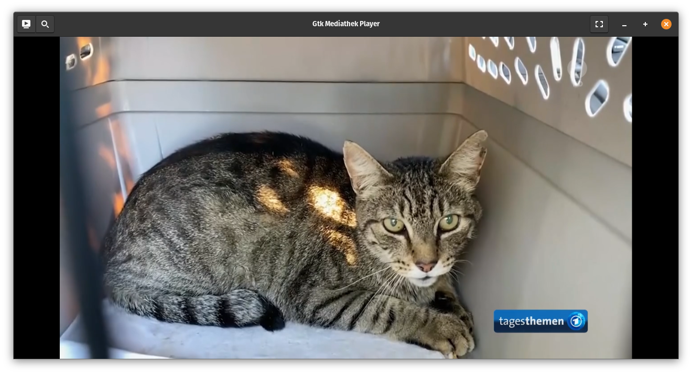

# gtk-mediathek-player

very simple python mediathek viewer for GNOME (using https://mediathekviewweb.de/'s API for search requests).




## Installation

tested on ubuntu 21.04

**dependencies**

```bash
sudo apt install python3-pip gstreamer1.0-plugins-bad
```

**install directly from the git repository**

```
pip3 install --user git+https://the-cake-is-a-lie.net/gogs/jonas/mediathek-viewer.git
```

if the package is installed user or system wide, there should exist a new start menu entry after installation. Otherwise the program can be started manually with:

```bash
python3 -m gtk_mediathek_player.main
```

